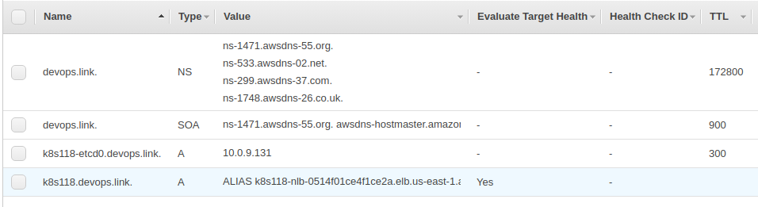
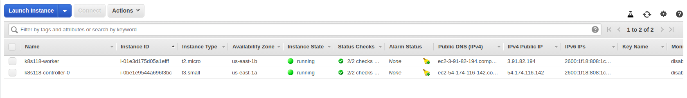
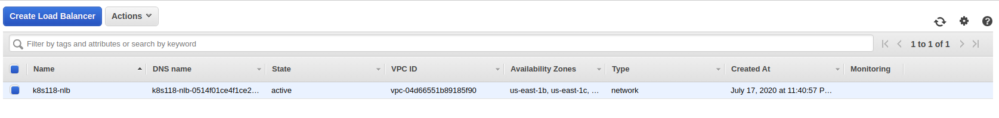
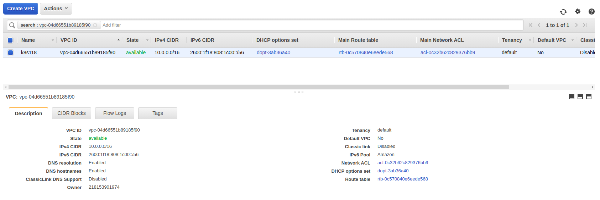
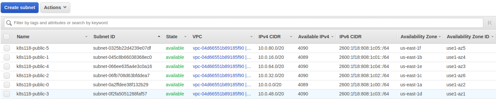
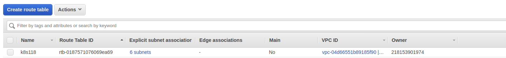
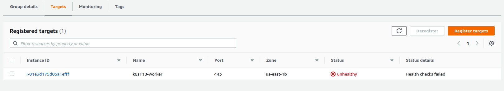

## Objective: To create a kubernetes cluster using typhoon (IN PROGRESS)

[Link Referred](https://typhoon.psdn.io/flatcar-linux/aws/)
[Git Repo](https://github.com/poseidon/typhoon/)

### Steps

- Create a DNS zone using [task-011-route53](../task-011-route53) and get the zone name and zone_id
```bash
Apply complete! Resources: 1 added, 0 changed, 0 destroyed.

Outputs:

devopslink-name-servers = [
  "ns-1471.awsdns-55.org",
  "ns-1748.awsdns-26.co.uk",
  "ns-299.awsdns-37.com",
  "ns-533.awsdns-02.net",
]
devopslink-public-zone-id = Z05864136COJL92HYXZ5
```

- Assign those values in the variables file in this task

- init
```bash
$ terraform init
```

- plan
```bash
$ TF_LOG=TRACE terraform plan
.
.
.
Plan: 91 to add, 0 to change, 0 to destroy.
```

- apply
```bash
$ TF_LOG=TRACE terraform apply
```

- Route53 Records which get created



- Instances created



- Load Balancer Created



- VPC Created



- Subnets Created



- Route Tables


- Target Groups health check (currently failing)




ERROR :( keeps on continuing
```bash
module.tempest.null_resource.bootstrap: Provisioning with 'remote-exec'...
2020-07-17T23:44:45.562+0400 [DEBUG] plugin.terraform: remote-exec-provisioner (internal) 2020/07/17 23:44:45 [DEBUG] Connecting to 54.174.116.142:22 for SSH
module.tempest.null_resource.bootstrap (remote-exec): Connecting to remote host via SSH...
module.tempest.null_resource.bootstrap (remote-exec):   Host: 54.174.116.142
module.tempest.null_resource.bootstrap (remote-exec):   User: core
module.tempest.null_resource.bootstrap (remote-exec):   Password: false
module.tempest.null_resource.bootstrap (remote-exec):   Private key: false
module.tempest.null_resource.bootstrap (remote-exec):   Certificate: false
module.tempest.null_resource.bootstrap (remote-exec):   SSH Agent: true
module.tempest.null_resource.bootstrap (remote-exec):   Checking Host Key: false
2020-07-17T23:44:45.755+0400 [DEBUG] plugin.terraform: remote-exec-provisioner (internal) 2020/07/17 23:44:45 [DEBUG] Connection established. Handshaking for user core
2020/07/17 23:44:46 [TRACE] dag/walk: vertex "provisioner.remote-exec (close)" is waiting for "module.tempest.null_resource.bootstrap"
2020-07-17T23:44:47.191+0400 [DEBUG] plugin.terraform: remote-exec-provisioner (internal) 2020/07/17 23:44:47 [DEBUG] Telling SSH config to forward to agent
2020-07-17T23:44:47.191+0400 [DEBUG] plugin.terraform: remote-exec-provisioner (internal) 2020/07/17 23:44:47 [DEBUG] Setting up a session to request agent forwarding
2020-07-17T23:44:47.818+0400 [DEBUG] plugin.terraform: remote-exec-provisioner (internal) 2020/07/17 23:44:47 [INFO] agent forwarding enabled
2020-07-17T23:44:47.818+0400 [DEBUG] plugin.terraform: remote-exec-provisioner (internal) 2020/07/17 23:44:47 [DEBUG] starting ssh KeepAlives
2020-07-17T23:44:47.818+0400 [DEBUG] plugin.terraform: remote-exec-provisioner (internal) 2020/07/17 23:44:47 [DEBUG] opening new ssh session
module.tempest.null_resource.bootstrap (remote-exec): Connected!
2020/07/17 23:44:47 [TRACE] dag/walk: vertex "provider.null (close)" is waiting for "module.tempest.null_resource.bootstrap"
2020-07-17T23:44:48.013+0400 [DEBUG] plugin.terraform: remote-exec-provisioner (internal) 2020/07/17 23:44:48 [DEBUG] Starting remote scp process:  scp -vt /tmp
2020-07-17T23:44:48.212+0400 [DEBUG] plugin.terraform: remote-exec-provisioner (internal) 2020/07/17 23:44:48 [DEBUG] Started SCP session, beginning transfers...
2020-07-17T23:44:48.212+0400 [DEBUG] plugin.terraform: remote-exec-provisioner (internal) 2020/07/17 23:44:48 [DEBUG] Beginning file upload...
2020-07-17T23:44:48.417+0400 [DEBUG] plugin.terraform: remote-exec-provisioner (internal) 2020/07/17 23:44:48 [DEBUG] SCP session complete, closing stdin pipe.
2020-07-17T23:44:48.417+0400 [DEBUG] plugin.terraform: remote-exec-provisioner (internal) 2020/07/17 23:44:48 [DEBUG] Waiting for SSH session to complete.
2020-07-17T23:44:48.622+0400 [DEBUG] plugin.terraform: remote-exec-provisioner (internal) 2020/07/17 23:44:48 [ERROR] scp stderr: "Sink: C0644 41 terraform_187433809.sh\n"
2020-07-17T23:44:48.622+0400 [DEBUG] plugin.terraform: remote-exec-provisioner (internal) 2020/07/17 23:44:48 [DEBUG] opening new ssh session
2020-07-17T23:44:49.033+0400 [DEBUG] plugin.terraform: remote-exec-provisioner (internal) 2020/07/17 23:44:49 [DEBUG] starting remote command: chmod 0777 /tmp/terraform_187433809.sh
2020/07/17 23:44:49 [TRACE] dag/walk: vertex "meta.count-boundary (EachMode fixup)" is waiting for "module.tempest.null_resource.bootstrap"
2020-07-17T23:44:49.238+0400 [DEBUG] plugin.terraform: remote-exec-provisioner (internal) 2020/07/17 23:44:49 [DEBUG] remote command exited with '0': chmod 0777 /tmp/terraform_187433809.sh
2020-07-17T23:44:49.238+0400 [DEBUG] plugin.terraform: remote-exec-provisioner (internal) 2020/07/17 23:44:49 [DEBUG] opening new ssh session
2020-07-17T23:44:49.646+0400 [DEBUG] plugin.terraform: remote-exec-provisioner (internal) 2020/07/17 23:44:49 [DEBUG] starting remote command: /tmp/terraform_187433809.sh
2020/07/17 23:44:49 [TRACE] dag/walk: vertex "root" is waiting for "meta.count-boundary (EachMode fixup)"
2020/07/17 23:44:51 [TRACE] dag/walk: vertex "provisioner.remote-exec (close)" is waiting for "module.tempest.null_resource.bootstrap"
2020/07/17 23:44:52 [TRACE] dag/walk: vertex "provider.null (close)" is waiting for "module.tempest.null_resource.bootstrap"
2020/07/17 23:44:54 [TRACE] dag/walk: vertex "meta.count-boundary (EachMode fixup)" is waiting for "module.tempest.null_resource.bootstrap"
2020/07/17 23:44:54 [TRACE] dag/walk: vertex "root" is waiting for "meta.count-boundary (EachMode fixup)"
module.tempest.null_resource.bootstrap: Still creating... [10s elapsed]
2020/07/17 23:44:56 [TRACE] dag/walk: vertex "provisioner.remote-exec (close)" is waiting for "module.tempest.null_resource.bootstrap"
2020/07/17 23:44:57 [TRACE] dag/walk: vertex "provider.null (close)" is waiting for "module.tempest.null_resource.bootstrap"
2020/07/17 23:44:59 [TRACE] dag/walk: vertex "meta.count-boundary (EachMode fixup)" is waiting for "module.tempest.null_resource.bootstrap"
2020/07/17 23:44:59 [TRACE] dag/walk: vertex "root" is waiting for "meta.count-boundary (EachMode fixup)"
2020/07/17 23:45:01 [TRACE] dag/walk: vertex "provisioner.remote-exec (close)" is waiting for "module.tempest.null_resource.bootstrap"
2020/07/17 23:45:02 [TRACE] dag/walk: vertex "provider.null (close)" is waiting for "module.tempest.null_resource.bootstrap"
2020/07/17 23:45:04 [TRACE] dag/walk: vertex "meta.count-boundary (EachMode fixup)" is waiting for "module.tempest.null_resource.bootstrap"
2020/07/17 23:45:04 [TRACE] dag/walk: vertex "root" is waiting for "meta.count-boundary (EachMode fixup)"
module.tempest.null_resource.bootstrap: Still creating... [20s elapsed]
```